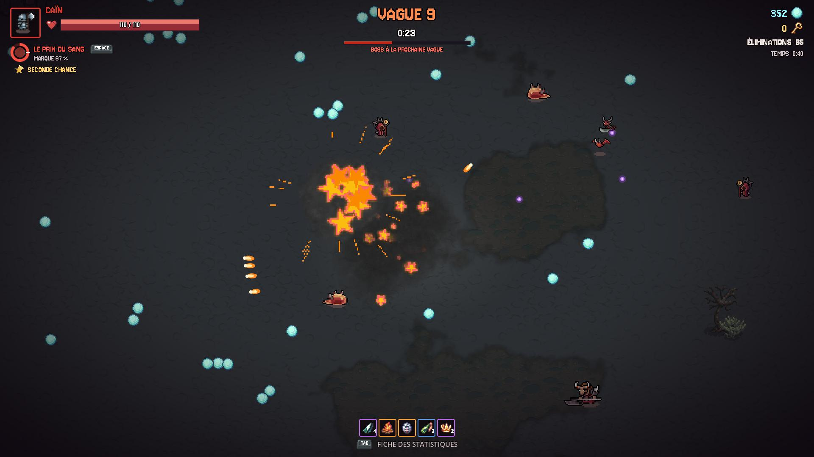
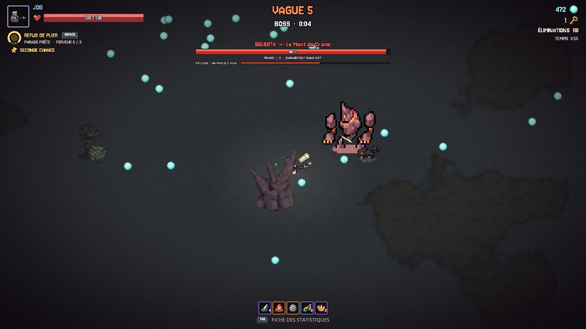
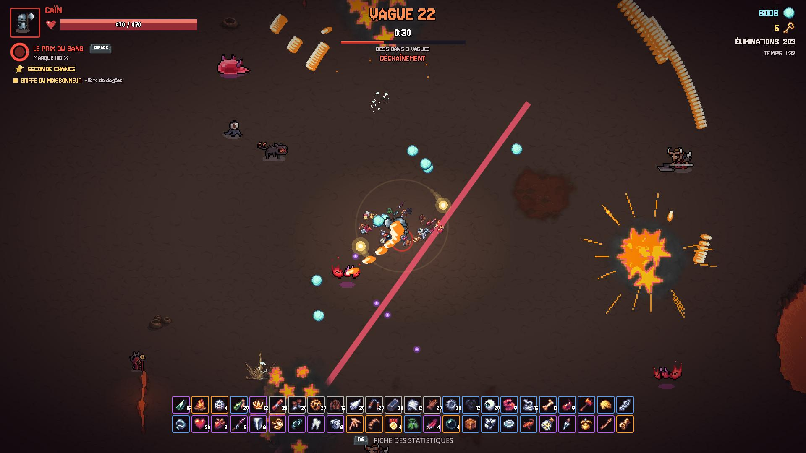
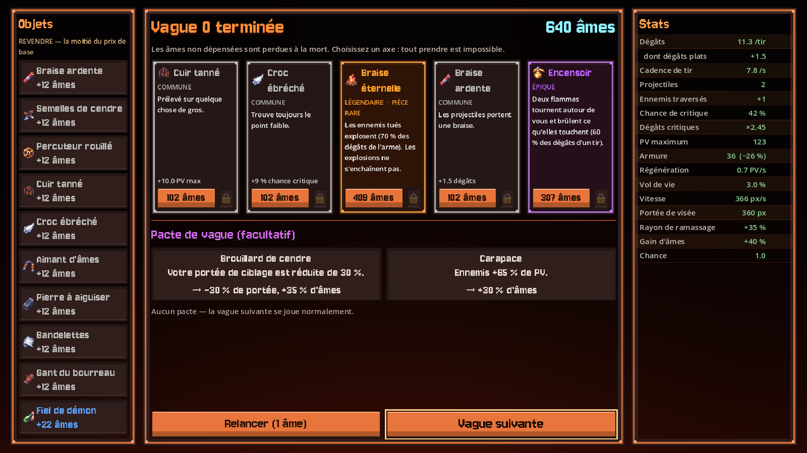

# Infernum

**Un roguelite d'action au fond de l'enfer.**

Le Ciel a fait un pari. L'Accusateur l'a perdu, et il veut sa revanche. Trois damnés — Caïn, Job et Loth — descendent vague après vague dans un enfer qui ne finit pas, face aux seigneurs qui le gardent.

## Télécharger

Les versions du jeu sont dans les **[Releases](../../releases)**.

| Fichier | Pour |
|---|---|
| `Infernum-<version>-android.apk` | Android : ouvrir le fichier sur le téléphone et autoriser l'installation |
| `Infernum-<version>-windows.zip` | Windows : décompresser et lancer `Infernum.exe` |
| `Infernum-<version>-web.zip` | navigateur : à héberger sur un serveur web (ne s'ouvre pas en double-cliquant) |
| `Infernum-bande-annonce-fr.mp4` · `Infernum-trailer-en.mp4` | la bande-annonce |

Le jeu est en **français** et en **anglais**.

## Le jeu

- **Trois damnés, trois façons de jouer.** Loth fuit et traverse les corps, Caïn dépense sa Marque dans le Prix du sang, Job encaisse et pare pour rendre son Jugement.
- **Des vagues qui ne pardonnent pas.** Votre arme tire seule ; vous, vous vous placez. Toute la difficulté est là : lire le sol et bouger.
- **Les seigneurs de l'enfer.** Un boss toutes les cinq vagues — Golgota, Lilith, Baal, Asmodée, Lucifer — chacun avec ses coups, ses phases et son histoire.
- **Une boutique et une Forge.** Achetez des objets entre les vagues, et renforcez chaque damné pour de bon entre les runs.
- **Le Déchaînement.** Abattez Lucifer pour le débloquer : plus aucune limite, et une partie qui ne s'arrête plus.
- **Une histoire à découvrir**, un bestiaire, un registre de pages perdues, et un classement de vos meilleures runs.

## Commandes

| Action | Clavier | Manette |
|---|---|---|
| Se déplacer | ZQSD / WASD ou les flèches | stick gauche ou croix |
| Pouvoir du damné | Espace | A |
| Fiche des statistiques | Tab | Select |
| Pause | Échap | B |

Les commandes de jeu (déplacement, pouvoir, fiche) se réassignent dans les options.

**Au doigt** (téléphone, tablette) : le joystick se pose sous le pouce dans la moitié gauche de l'écran, le pouvoir est en bas à droite, la pause et la fiche en haut à droite. L'option **Taille de l'interface** agrandit les textes et les boutons.

---

## English

**An action roguelite in the depths of hell.** Three damned souls — Cain, Job and Lot — fight wave after wave through an endless hell and the lords who guard it. The game is available in English and French: download it from the **[Releases](../../releases)** (Android, Windows, or a web build to host on a server). On a phone, the game is played with touch controls.

---

*Infernum — tous droits réservés. Ce dépôt ne contient que le jeu compilé ; le code source n'est pas public. Les assets tiers sont utilisés sous les licences de leurs auteurs, et ne peuvent pas être extraits ni redistribués.*
